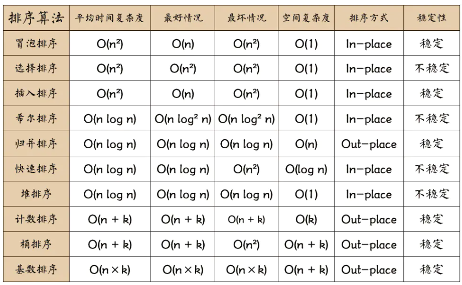

<h1> 排序算法小结</h1>

* 一、非线性时间比较类排序
  * 1.1 交换排序
    * [冒泡排序](#1.1.1)：O(N2) 稳定
    * [快速排序](#1.1.2)：O(NlogN) 不稳定
  * 1.2 插入排序
    * [直接插入排序](#1.2.1)：O(N2) 稳定
    * [希尔排序](#1.2.2)：O(NlogN) 不稳定
  * 1.3 选择排序
    * [直接选择排序](#1.3.1)：O(N2) 不稳定
    * [堆排序](#1.3.2)：O(NlogN) 不稳定
  * 1.4 [归并排序](#1.4)：O(NlogN) 稳定
* 二、线性时间非比较类排序
  * 2.1 [计数排序](#2.1)：O(N + K) 稳定
  * 2.2 [桶排序](#2.2)
  * 2.3 [基数排序](2.2)



排序算法的稳定性：能保证排序前2个相等的数其在序列的前后位置顺序和排序后它们两个的前后位置顺序相同——则稳定

```
背景：给一个整数数组nums，要求将该数组升序或者降序排列。
```


<h2 id="1.1.1">冒泡排序</h2>

**思路**：

冒泡排序在扫描过程中两两比较相邻记录，如果反序则交换，最终，最大记录就被“沉到”了序列的最后一个位置，第二遍扫描将第二大记录“沉到”了倒数第二个位置，重复上述操作，直到 `n-1` 遍扫描后，整个序列就排好序了。

**代码（默认升序）**：

`for(int i = 0; i < n - 1; i++)`：`i`从`0`开始，那么`i`最大能取到`n-2`，总共会遍历`n-1`次

```C++
class Solution {
public:
    vector<int> sortArray(vector<int>& nums) {
        bubbleSort(nums);
        return nums;
    }
    //冒泡排序的实现
    void bubbleSort(vector<int>& arr) {
        for(int i = 0; i < arr.size() - 1; i++) {  //i控制len-1趟冒泡（len-1是因为最后一个数不需要比较，自然会得到）
            //j控制每趟冒泡时两两比较的下标索引
            for(int j = 0; j < arr.size() - 1 - i; j++) {  //(arr.size() - 1) - i
                if(arr[j] > arr[j + 1]) {  //降序：">"改成"<"
                    swap(arr[j], arr[j + 1]);
                }
            }
        }
    }
};
```

> 时间复杂度：`O(N^2)`
>
> 空间复杂度：`O(1)`


<h2 id="1.1.2">快速排序</h2>

**思路**：

见[该链接](https://blog.csdn.net/qq_28584889/article/details/88136498)，配合图片

**代码（默认升序）：**

```c++
class Solution {
public:
    vector<int> sortArray(vector<int>& nums) {
        quickSort(0, nums.size() - 1, nums);  //调用快排
        return nums;
    }
    //快排的实现
    void quickSort(int left, int right, vector<int>& arr) {  //left，right为待排序区间的左右边界下标
        if(left > right) return;  //递归终止条件
        int i = left, j = right;  //初始化i，j哨兵
        int base = arr[left];  //初始化base值等于最左边的元素
        while(i < j) {
            //注意两个哨兵移动的先后顺序：哪边初始化为base，就从另一边开始
            while(arr[j] >= base && i < j) {  //哨兵j向左移动，寻找小于base的元素（注意此处的等号）
                j--;
            }
            while(arr[i] <= base && i < j) {  //哨兵i向右移动，寻找大于base的元素
                i++;
            }
            swap(arr[i], arr[j]);  //两个哨兵都找到满足条件的值后，交换两者
        }
        swap(arr[left], arr[i]);  //直至哨兵相遇，将base值归位
        quickSort(left, i - 1, arr);  //递归左子列
        quickSort(i + 1, right, arr);  //递归右子列
    }
};
```

降序排列：只需要修改两个哨兵左右移动条件的不等号即可

> 时间复杂度：`O(NlogN)`，这里 *N* 是数组的长度
>
> 空间复杂度：`O(logN)`，这里占用的空间主要来自递归函数的栈空间

 快速排序之所比较快，因为相比冒泡排序，每次交换是跳跃式的。每次排序的时候设置一个基准点，将小于等于基准点的数全部放到基准点的左边，将大于等于基准点的数全部放到基准点的右边。这样在每次交换的时候就不会像冒泡排序一样每次只能在相邻的数之间进行交换，交换的距离就大的多了。因此总的比较和交换次数就少了，速度自然就提高了。当然在最坏的情况下，仍可能是相邻的两个数进行了交换。因此快速排序的最差时间复杂度和冒泡排序是一样的都是`O(N2)`，它的平均时间复杂度为`O(NlogN)`。


<h2 id="1.2.1">插入排序</h2>

**思路**：

1. 从第一个元素`(i=0)`开始，该元素可以认为已被排序，所以`i`从`1`开始；
2. 取出下一个元素，在已经排序的元素序列中从后向前扫描（由`j`控制）；
3. 如果该元素（已排序）大于新元素，将该元素移到下一个位置；
4. 重复步骤3，直到找到已排序的元素小于或者等于新元素的位置；
5. 将新元素插入到该位置后，重复2~5

总结：默认第一个数是有序的，`i`从第二个数开始，将`nums[i]`与前面的有序数组逐一比较大小，找到合适的位置，借助`j`插入进去，直到`i`将`nums`中所有的数字遍历完成

**代码（默认升序）**：

```c++
class Solution {
public:
    vector<int> sortArray(vector<int>& nums) {
        selectSort(nums);
        return nums;
    }
	//选择排序的实现
    void selectSort(vector<int>& arr) {
        //i控制遍历插入的轮次，j用来将前面有序的元素后移（i从1开始，默认第一个元素已经排序）
        for(int i = 1; i < arr.size(); i++) {
            //暂存位置i的元素值
            int temp = arr[i];
            int j = i;
            //根据升（降）序将前面的有序数字后移直到j为0 或 找到已排序的元素小于或者等于新元素(temp)的位置
            while(j > 0 && arr[j - 1] > temp) {  //降序只需要改变">"为"<"
                arr[j] = arr[j - 1];
                j--;
            }
            //将（暂存的）待插入元素插入
            arr[j] = temp;
        }
    }
};
```

> 时间复杂度：最好`O(N)`（已经有序） 最坏`O(N^2)`（全部倒序）
>
> 空间复杂度：`O(1)`


<h2 id="1.2.2">希尔排序</h2>

**[思路](https://blog.csdn.net/Hedenghui777/article/details/113135157)**：

「希尔排序」是对直接插入排序的优化，在直接插入排序里，如果靠后的数字较小，它来到前面就得交换多次。「希尔排序」改进了这种做法。带间隔地使用插入排序，直到最后「间隔」为 1 的时候，就是标准的「插入排序」，此时数组里的元素已经「几乎有序」了

**代码（默认升序）**：

```c++
class Solution {
public:
    vector<int> sortArray(vector<int>& nums) {
        shellSort(nums);
        return nums;
    }

    void shellSort(vector<int>& arr) {
        int len = arr.size();
        int gap = 1;
        //使用knuth增量序列找增量gap的最大值
        while(3 * gap + 1 < len) {
            gap = 3 * gap + 1;
        }
        while(gap >= 1) {  //最后gap都会等于1，所以此处为">="
            //按照间隔gap将nums分成不同的组，每个组内进行插入排序
            //直至最后gap为1，所有元素都在同一组中，便是基本的插入排序算法
            for(int i = gap; i < len; i++) {
                insertByGap(arr, gap, i);
            }
            gap = gap / 3;
        }
    }
	//和插入排序类似，只不过将nums[i]插入到对应分组的正确位置上（与gap相关）
    void insertByGap(vector<int>& arr, int gap, int i) {
        int temp = arr[i];
        int j = i;
        while(j >= gap && arr[j - gap] > temp) {  //降序只要将">"改成"<"即可
            arr[j] = arr[j - gap];
            j -=gap;
        }
        arr[j] = temp;
    }
};
```

> 时间复杂度：根据增量序列的不同而不同
>
> 空间复杂度：`O(1)`


<h2 id="1.3.1">选择排序</h2>

**思路**：

每一轮**选择**最小的元素，将其交换到前面**未排定部分**的开头。

也就是说：对于每一个数`nums[i]`，都要对它及后面所有数进行大小比较，得到后面下标区间`[i, len - 1]`内最小的数`nums[minIndex]`，再将这两个数进行交换。

**代码（默认升序）**：

```c++
class Solution {
public:
    vector<int> sortArray(vector<int>& nums) {
    	selectSort(nums);
        return nums;
    }
    //选择排序的实现
    void selectSort(vector<int>& arr) {
        int len = arr.size();
        //[0,i)有序，且该区间里所有的元素就是最终排定的样子
        for(int i = 0; i < len - 1; i++) {
            //选择区间[i, len - 1]内最小元素的索引，将其与下标i的元素（即未排定部分的开头）交换
            int minIndex = i;
            for(int j = i + 1; j < len; j++) {
                if(arr[j] < arr[minIndex]) {  //降序：将"<"改成">"
                    minIndex = j;
                }
            }
            swap(arr[i], arr[minIndex]);
        }
    }
};
```

> 时间复杂度：`O(N^2)`
>
> 空间复杂度：`O(1)`


<h2 id="1.3.2">堆排序</h2>

**堆**通常是一个可以被看做一棵**完全二叉树的数组对象**

**思路**：

* 将无序序列构建成一个堆，根据升序降序需求选择大顶堆或小顶堆
* 将堆顶元素与末尾元素交换，将最大元素"沉"到数组末端
* 重新调整结构，使其满足堆定义，然后继续交换堆顶元素与当前末尾元素，反复执行调整+交换步骤，直到整个序列有序

参考链接：

[链接1](https://leetcode-cn.com/problems/sort-an-array/solution/fu-xi-ji-chu-pai-xu-suan-fa-java-by-liweiwei1419/)

[链接2](https://www.cnblogs.com/chengxiao/p/6129630.html)

**代码（默认升序）**：

```c++
/*
代码主要由三部分组成：
1：构建初始堆
2：交换堆顶元素和末尾元素
3：重建堆
*/
class Solution {
public:
    vector<int> sortArray(vector<int>& nums) {
        heapSort(nums);
        return nums;
    }

    //堆排序的实现
    void heapSort(vector<int>& arr) {
        int len = arr.size();
        //先将无序序列建堆（升序——大顶堆，降序——小顶堆）
        buildHeap(arr);
        //对排列成大顶堆的数据：将堆顶的元素arr[0]与最后一个元素arr[i]交换（使最大元素到最后），
        //再调整交换后堆顶较小的元素(使其下沉)，将其也排列成大顶堆，称为重建堆
        //如此循环下沉得到递增序列
        for(int i = len - 1; i >= 0;) {
            swap(arr[0], arr[i]);
            i--;
            adjustHeap(arr, 0, i);
        }
    }
   
    //建堆函数的实现
    void buildHeap(vector<int>& arr) {
        int len = arr.size();
        //从最下面的非叶子节点开始向上遍历进行adjust（如下标从2->1->0，对应在树上的位置就是从右至左，从下至上）
        for(int i = (len - 1)/2; i >= 0; i--) {
            adjustHeap(arr, i, len - 1);
        }
    }

    //将当前节点k进行交换，以满足大（小）顶堆的要求
    void adjustHeap(vector<int>& arr, int k, int end) {
        //2k+1就是k节点的左子节点
        while(2 * k + 1 <= end) {  //2k+1 <= len意味着左子节点存在
            int j = 2 * k + 1;  //用j来记录k的左子节点的下标
            //则j+1就是k的右子节点的下标
            if(j + 1 <= end && arr[j+1] > arr[j]) {  //若右子节点存在且右子节点值大于左子节点
                j++;  //则j更新为右子节点的下标（j始终是k左右节点中更大的那个）
            }
            //将k节点与j节点值比较大小，由于构造大顶堆，则上层的值要大于下层的值
            if(arr[k] < arr[j]) {  //如果不满足大顶堆的要求
                swap(arr[k], arr[j]);  //则将两个值交换（小的值下沉）
            }
            else {  //否则说明此小分支满足大顶堆的要求，无需交换，退出循环
                break;
            }
            k = j;  //交换完成后将k更新为j，因为发生了交换，不能保证当前的子节点是它子树的最大值，所以需要继续向下比较
        }
    }
};
```

注意：降序只需要将`adjustHeap()`函数中两个`if`里面的不等号取反即可

> 时间复杂度：`O(nlogn)`
>
> 空间复杂度：`O(1)`


<h2 id="1.4">归并排序</h2>

**思路**：

见[剑指Offer51数组中的逆序对](https://github.com/Yorkzhang19961122/LeetCodeNotebook/blob/main/%E5%89%91%E6%8C%87Offer/%E5%89%91%E6%8C%87Offer51.%E6%95%B0%E7%BB%84%E4%B8%AD%E7%9A%84%E9%80%86%E5%BA%8F%E5%AF%B9_H/%E5%89%91%E6%8C%87Offer51.%E6%95%B0%E7%BB%84%E4%B8%AD%E7%9A%84%E9%80%86%E5%BA%8F%E5%AF%B9_H.md)题解的分析

**代码（默认升序）**：

```c++
class Solution {
public:
    vector<int> sortArray(vector<int>& nums) {
        mergeSort(nums, 0, nums.size() - 1);
        return nums;
    }
	//归并排序的实现
    void mergeSort(vector<int>& arr, int left, int right) {
        int mid = left + (right - left) / 2;  //找中间点
        if(left < right) {
            mergeSort(arr, left, mid);  //递归划分左子数组
            mergeSort(arr, mid + 1, right);  //递归划分右子数组
            mergeTwoArray(arr, left, mid, right);  //合并已经排序的子数组     
        }
    }

    void mergeTwoArray(vector<int>& arr, int left, int mid, int right) {
        vector<int> temp(right - left + 1, 0);  //temp数组用来存放排序后的结果
        int l_pos = left, r_pos = mid + 1;  //l_pos指向左有序数组的第一个元素，r_pos指向右有序数组的第一个元素
        int index = 0;
        while(l_pos <= mid && r_pos <= right) {  //合并两个有序数组到temp中
            if(arr[l_pos] <= arr[r_pos]) {  //降序只需要将"<="修改为">="即可
                temp[index++] = arr[l_pos++];
            }
            else {
                temp[index++] = arr[r_pos++];
            }
        }
        while(l_pos <= mid) {  //把左子数组剩余的数移入temp数组
            temp[index++] = arr[l_pos++];
        }
        while(r_pos <= right) {  //把右子数组剩余的数移入temp数组
            temp[index++] = arr[r_pos++];
        }
        for(int i = 0; i < temp.size(); i++) {  //将辅助数组temp中的元素覆盖原数组
            arr[left + i] = temp[i];
        }
    }
};
```

> 时间复杂度：`O(NlogN)`
>
> 空间复杂度：`O(N)`


<h2 id="2.1">计数排序</h2>

**思路**：

* 记录原数组中的`max`和`min`
* 创建`max-min + 1`这么大跨度的数组`count`用于统计原数组中各数字出现的次数（下标为数字，值为出现的次数）
* 将`count`中值大于`0`的下标索引输出到原数组中（注意还原时加上`min`）

**代码（默认升序）**：

```c++
class Solution {
public:
    vector<int> sortArray(vector<int>& nums) {
        countingSort(nums);
        return nums;
    }
    //计数排序的实现
    void countingSort(vector<int>& arr) {
        //记录原数组中的max和min
        int max = *max_element(arr.begin(), arr.end());
        int min = *min_element(arr.begin(), arr.end());
        //创建max-min+1这么大跨度的数组count用于统计原数组中各数字出现的次数（下标为数字，值为出现的次数）
        int len = max - min + 1;
        vector<int> count(len, 0);  
        for(int i = 0; i < arr.size(); i++) {
            count[arr[i] - min]++;
        }
        //将count中值大于0的下标索引输出到原数组中，注意还原时加上min
        int index = 0;
        for(int i = 0; i < len; i++) {  //降序只要在还原输出的时候倒序即可: for(int i = len - 1; i >= 0; i--)
            while(count[i] > 0) {
                arr[index++] = i + min;
                count[i]--;
            }
        }
    }
};
```

> 时间复杂度：O(N+K)，其中K是待排序数组元素的最大值
>
> 空间复杂度：O(K)

计数排序的缺点：

* 元素中有小数时不适合用计数排序
* 元素大小相差较大时不适合（或者K非常大时），容易造成元素分布不集中，浪费空间

