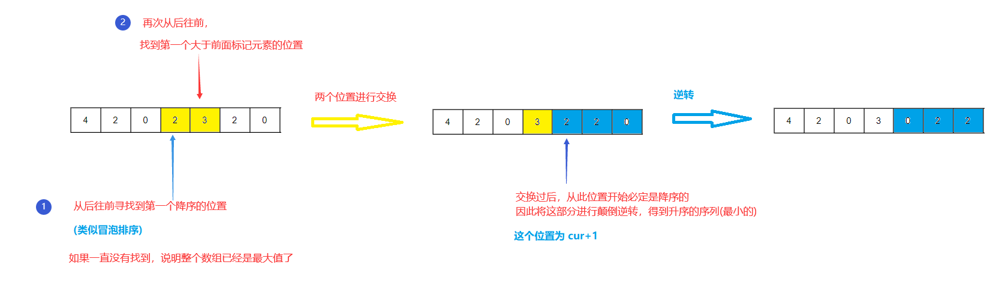

【题目】

实现获取 下一个排列 的函数，算法需要将给定数字序列重新排列成字典序中下一个更大的排列。

如果不存在下一个更大的排列，则将数字重新排列成最小的排列（即升序排列）。

必须 **原地** 修改，只允许使用额外常数空间。

【示例】

```c++
输入：nums = [1,2,3]
输出：[1,3,2]
```

---

【[题解思路—两次遍历](https://leetcode-cn.com/problems/next-permutation/solution/xia-yi-ge-pai-lie-by-leetcode-solution/)】



【题解代码—两次遍历】

```c++
class Solution {
public:
    void nextPermutation(vector<int>& nums) {
        //从右往左遍历找到第一个下降的位置i
        int i = nums.size() - 2;
        while(i >= 0 && nums[i] >= nums[i + 1]) {
            i--;
        }
        //如果存在这样的i，那么再从右往左遍历找到最小的比nums[i]大的数nums[j],交换两者
        if(i >= 0) {
            int j = nums.size() - 1;
            while(j > i && nums[i] >= nums[j]) {
                j--;
            }
            swap(nums[i], nums[j]);
        }
        //翻转i往后的数字: [i + 1, end]
        //如果不不存在下一个更大的排列（即已经是降序排列），则此处直接对整个数组进行翻转（升序排列）
        reverse(nums.begin() + i + 1, nums.end());
    }
};
```

